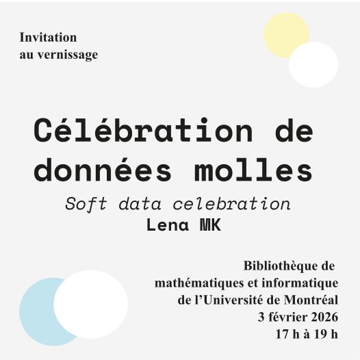

La *Célébration de données molles* est une matérialisation de données de la collection du Musée d'art contemporain de Montréal.

[Lena MK](https://lenamk.site/bio), 2025

**Février 2026**: Exposition à la bibliothèque de mathématiques et informatique de l'Université de Montréal tout le mois, et [atelier de bricolage](https://calendrier.umontreal.ca/activite/atelier-de-bricolage-de-donnees) le 4 février 2026.

- [Affiche présentée dans l'espace d'exposition](./files/afficheExpo_2026.pdf)
- [Légende et description courte](./files/legendePresentationExpo_2026.pdf)

Un énorme merci à l'équipe de la bibliothèque de mathématique et informatique et des bibliothèques de l'UdeM pour leur soutien et leur collaboration 🩵

## À propos des *données molles*

- [Audiodescription (avec transcription)](./audiodescription)
- [English description](./softDataCelebration)

## Découvrir l'installation et les données: espace numérique

- [Exploration par année](./interface_demo/index.html)
- [Notebook pour explorer les données](https://observablehq.com/@lenamk/soft-data-demo) (peu adapté pour la vue mobile)

## Recherche et documentation

- [Étapes de l'examen de synthèse](http://lenamk.site/doc/#examen-de-synth%C3%A8se-mai-2025), l'installation a été réalisée en tant que partie pratique de l'examen et présentée pour la première fois en mai-juin 2025
- [Documentation photographique participative](https://u.pcloud.link/publink/show?code=kZSGxe5ZrsmgqJYI2gkRvTaHkVq9MY4FUfEX), *Citer le projet en cas de réutilisation/diffusion des photographies svp*, mai-juin 2026
- Documentation wiki
    - [description sur wikidata](https://www.wikidata.org/wiki/Q134700898)
    - [photographie sur wikimédia commons](https://commons.wikimedia.org/wiki/File:Soft_Data_Celebration_data_physicalization_by_Lena_MK_2.jpg)
- [Submission to CSDH2026 call for papers](./CSDH-2026.md)

**Comment citer**: Lena MK, *Célébration de données molles* ou *Soft data celebration* [selon la langue], 2025, installation et physicalisation de données.

## Visualisations expérimentales

Ces visualisations sont faites pour être consultées sur un écran d'ordinateur, elles n'ont pas été adaptées pour la vue mobile.

**Collection complète**
- [*Ribon curtain*](./exSynth/index.html)

**Techniques mixtes**
- [Ribon curtain](./MAC-techniquesMixtes/index.html)
- [Interface de fabrication](./making_donneesMolles/index.html), pour visualisation et légende par année. Ajouter l’année voulue dans les paramètres de l’URL ex: `?year=2020`

## Répertoire des données utilisées

Consulter les fichiers `.json` utilisés dans le navigateur:

- Données du MAC (téchargement de la version le 20 mars 2025). Source: [donnéesQuébec](https://www.donneesquebec.ca/recherche/organization/macm)
  - [Artistes](./data/artistes-mac.json)
  - [Œuvres](./data/oeuvres-mac.json)
- [Index des origines](./data/index_origines_court.json) (version résumée), issu du Notebook [*Index des origines associées aux œuvres*](https://observablehq.com/@lenamk/index-des-origines-associees-aux-uvres) 
- [Index des origines](index_origines.json) (version longue, contient chaque œuvre)
- [Index des artistes et leurs origines associées](./data/index_origines_artistes.json)

---

<small>Date de dernière mise à jour: Janvier 2026</small>